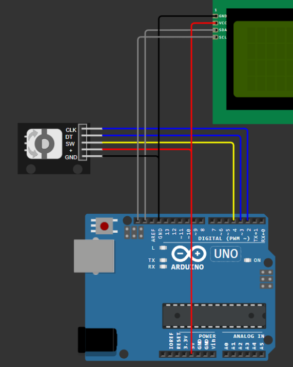
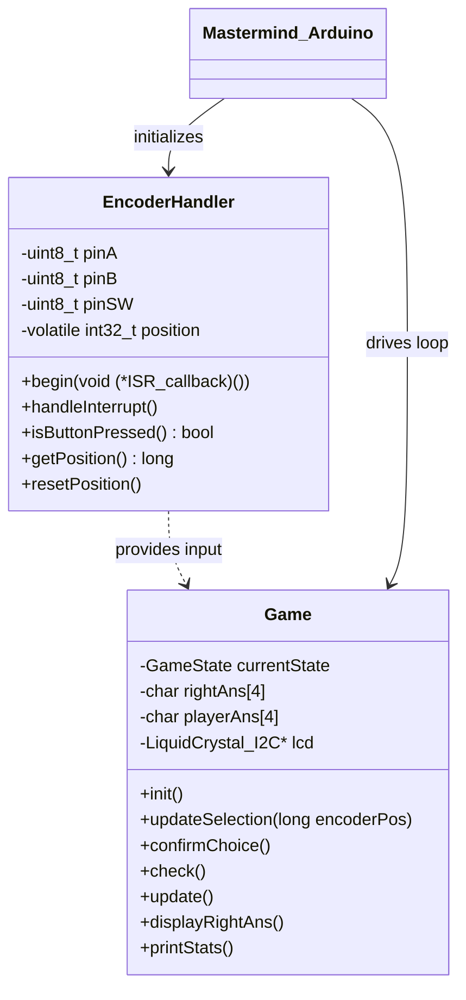

# Mastermind Game for Arduino

A modular, object-oriented implementation of the classic Mastermind logic game for the Arduino platform. This project features a rotary encoder interface, I2C LCD support, and interrupt-driven input handling.

## Features
* **Modular Design**: Separate classes for game logic (`GameLogic`) and hardware abstraction (`EncoderHandler`).
* **Efficient Input**: Uses hardware interrupts for the rotary encoder to ensure zero missed steps and smooth UI.
* **Simulation Ready**: Includes `diagram.json` for immediate testing in the Wokwi simulator.
* **Dynamic Feedback**: Real-time LCD updates with custom characters for "right position" (⬤) and "wrong position" (◯).
---
## Hardware Requirements
* **Arduino Uno** (or compatible)
* **Rotary Encoder**
* **LCD 20x4 I2C**
* **Connecting Wires**
---

## Installation & Setup

1.  **Clone the repository**:
    ```bash
    git clone https://github.com/Osoba54/mastermind-arduino.git
    ```
2.  **Library Requirements**:
    * Install `LiquidCrystal I2C` by Frank de Brabander via the Arduino Library Manager.
3.  **Hardware Connection**:
    * Connect Encoder CLK/DT to Pins 2 and 3 (Interrupt pins).
    * Connect LCD SDA/SCL to Pins A4 and A5 (SDA and SCL pins).
4.  **Upload**: Open `mastermind-arduino.ino` and hit Upload.



## How to Play

The goal is to crack a hidden 4-character code. The game uses a rotary encoder for an intuitive, tactile experience.

1.  **Selection**: Rotate the encoder to cycle through available characters (`@`, `#`, `$`, `%`, `&`) at the current position.
2.  **Confirmation**: Press the encoder button (**SW**) to confirm your choice. The cursor will automatically move to the next slot.
3.  **Round Evaluation**: Once all 4 slots are filled, the game evaluates your guess and displays the result in the next column.
4.  **Feedback Symbols**:
    * **⬤ (Custom Char 1)**: Correct character in the **correct** position.
    * **◯ (Custom Char 0)**: Correct character, but in the **wrong** position.
    * *Empty space*: The character does not exist in the hidden code.
5.  **Winning/Losing**:
    * **Win**: Match all 4 positions (4x ⬤).
    * **Loss**: If you don't guess the code within **9 attempts**, the hidden code is revealed on the far right of the display.

---

## System Architecture (UML)

The project follows an Object-Oriented approach to separate hardware interaction from game logic.



---

## License
This project is licensed under the **MIT License** - see the [LICENSE](LICENSE) file for details.

## Author
**Plisz Ksawery (Osoba54)**
* **Email**: [ksawery112007@gmail.com](mailto:ksawery112007@gmail.com)
* **GitHub**: [Osoba54](https://github.com/Osoba54)

